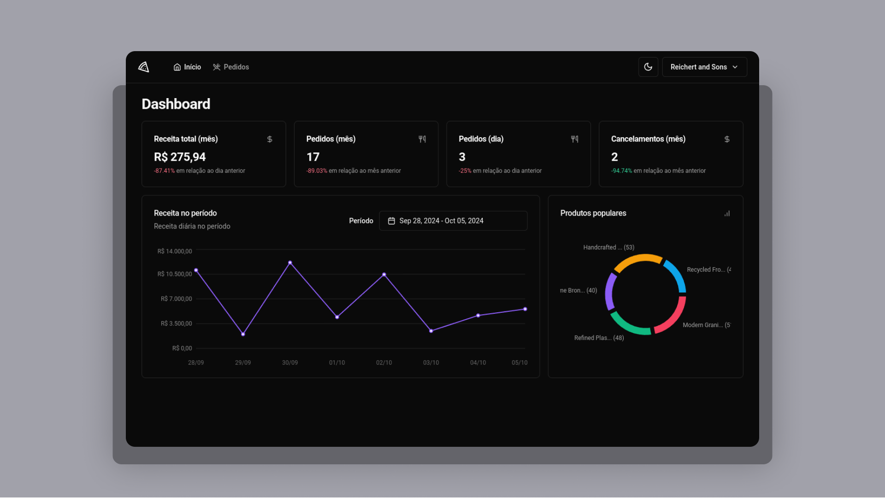

# Pizza.shop
[](#)

With the **Pizza.shop**, you can manage your store, register and track your restaurant orders. 

> Status: Finished... ✅

## Technologies 🚀


## Libs 📕

📑 **REACT HOOK FORM**

📑 **ZOD**

📑 **TANSTACK REACT QUERY**

📑 **AXIOS**

📑 **LUCIDE ICONS**

📑 **ESLINT**

📑 **DATE FNS**

## Features and End to End Tests 💡

✅ **SIGN IN / SIGN UP**

✅ **CRUD PROFILE**

### Dashboard

✅ **DISPLAY DAY ORDERS AMOUNT METRIC**

✅ **DISPLAY MONTH ORDERS AMOUNT METRIC**

✅ **DISPLAY MONTH CANCELED ORDERS AMOUNT METRIC**

✅ **DISPLAY MONTH ORDERS AMOUNT METRIC**

✅ **DISPLAY MONTH REVENUE METRIC**

### Orders

✅ **LIST ORDERS**

✅ **PAGINATION ORDERS**

✅ **FILTER ORDER BY ID**

✅ **FILTER BY CUSTOMER NAME**

✅ **FILTER BY STATUS**

## How do use the project ⚙️

### Frontend

#### 1. Clone the repository
```sh
git clone https://github.com/reinheimermat/pizzashop-web
```
#### 2. install dependencies
```sh
pnpm install
```
#### 2. Config envoriments
Rename the file **.env.example** to **.env**

#### 4. Run local project
```sh
pnpm run dev
```
#### 5. Access the project
```sh
http://localhost:5173/
```
### Backend

#### 1. Clone the repository
```sh
git clone https://github.com/rocketseat-education/pizzashop-api
```
#### 2. Config envoriments
Rename the file **.env.example** to **.env**

#### 3. Install dependencies
```sh
bun i
```
#### 4. Run create database with Prisma
```sh
bun migrate
```

#### 5. Run the project
```sh
bun dev
```

## Links 🔗

[](https://www.figma.com/community/file/1392276515495389646)

## License 📝

[](https://github.com/Ileriayo/markdown-badges/blob/master/LICENSE)